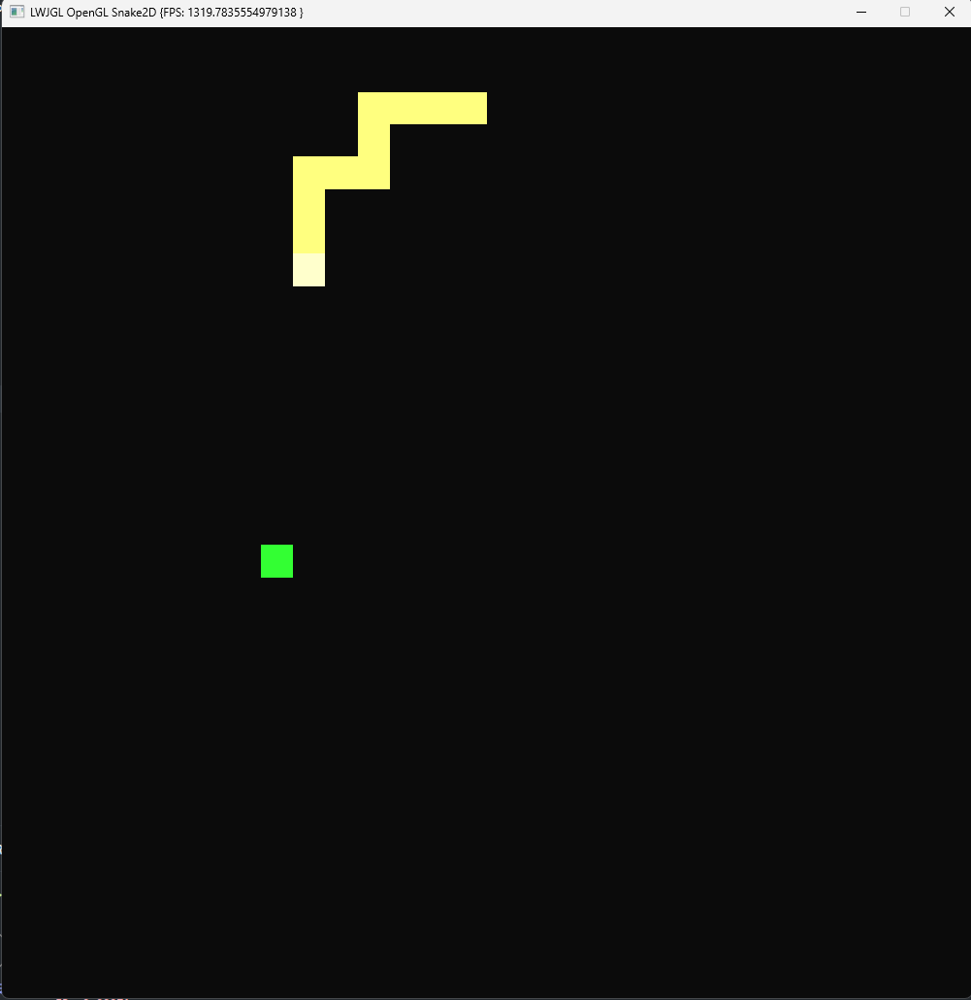

# OpenGL Snake 2D
***

This is my OpenGL clone game of snake. I enjoyed making this as it allowed me to experiment with Kotlin, different types of movement, collision, and recursive methods.

Here is an example of the current version:

## Technology used
LWJGL - OpenGL and other low level bindings for Java
GLFW - Window creation
Joml - Maths library
OpenGL
Kotlin and Java
